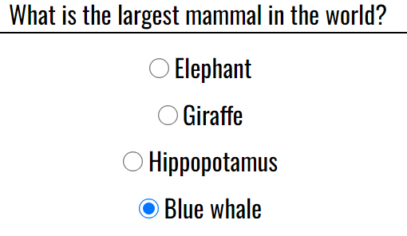
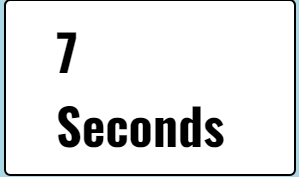
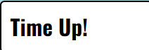
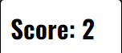
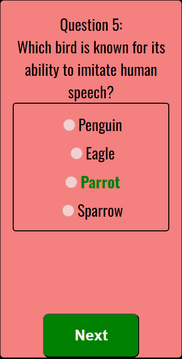
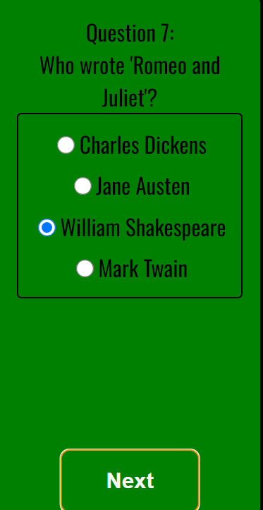
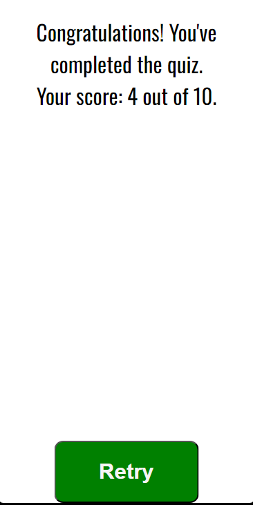

# Rapid-Fire Quiz

A fun, rapid fire quiz to test your general knowledge. Randomly selected questions and a countdown timer to add pressure! It tracks your score out of 10 and lets you know how you did at the end. Quiz can be retried at the end to try and beat your top score. 


How my pages look across desktop, tablet and mobile.

## Features
### Existing Features

- Landing page with Explanation
   - The landing page is simple and intuitive. It provides a quick explanation of how the quiz works and a big start button.
- Question Counter
   - A counter to keep track of what number question you are on
      
- Randomly chosen questions each time
   - I have added an array of 20 questions and shuffle the questions so that each time you start the quiz you get different questions given to you. No question will be repeated twice in the quiz.
   
- Countdown Timer
  - A 10 second countdown timer starts as soon as you click the start button. If it reaches zero you will get 0 points and it will say 'Time up!'. You will also be shown the correct answer and can review the question before clicking 'next' to continue with the quiz. Radio buttons are disabled if timer reaches zero to prevent a user clicking the correct answer after it has been shown.
  - Timer resets for every question and stops once you finish the last question.
  
  
- Score Counter
  - A score counter to track your score out of 10. One point for each correct answer, no point if incorrect or if not answered within the 10 seconds. Hidden until the quiz starts.
  
- Visual Cues
  - Game area goes green if correct. If incorrect, score area turns red and the correct answer is highlighted for two seconds before moving automatically to the next question.
  
  
- Congratulations Message
  - At the end of the quiz a message will appear letting you know how you did in the quiz.
  
- Restart Feature
- After completing the quiz, users can click the restart button to reset the timer, score, and questions.

### Features Left to Implement

- Highscore board where users could input their name and be added to a leaderboard.
- Addittional quiz options to test different areas of knowledge.

## Testing
- All html,css and javascript was passed through w3c validator and [https://jshint.com] .  Results shared below.

- Project was tested with lighthouse to ensure accessibility and performance was to a high quality. I ran a test for mobile pages and another for desktop pages. Results are posted below.

- I have also tested the site by manually clicking through all available links to ensure they are working correctly. I have included the results of this test in a table below.

## Validator Testing
### HTML
- No errors were returned when passing through the official W3C validator
[https://validator.w3.org/nu/?showsource=yes&doc=https%3A%2F%2Fbrendangcollins.github.io%2FPortfolio-Project-2---Javascript-Essentials%2F]

### CSS
- No errors were found when passing through the official (Jigsaw) validator
[https://jigsaw.w3.org/css-validator/validator?uri=https%3A%2F%2Fbrendangcollins.github.io%2FPortfolio-Project-2---Javascript-Essentials%2F&profile=css3svg&usermedium=all&warning=1&vextwarning=&lang=en]

### Javascript
- No errors were found when passing through [https://jshint.com]

### Lighthouse mobile report 


### Lighthouse desktop report 


### Manual Testing

<table>
    <tr>
        <th>Action</th>
        <th>Expected Behavior</th>
        <th>Pass or Fail</th>
    </tr>
    <tr>
        <td>Click 'Start' button</td>
        <td>Random question appears, timer starts counting down, score counter appears, and 'Next' button becomes visible.</td>
        <td>Pass</td>
    </tr>
    <tr>
        <td>Check the 'Next' button before answering the question</td>
        <td>'Next' button should be disabled until an answer is selected or the timer runs out.</td>
        <td>Pass</td>
    </tr>
    <tr>
        <td>Select the correct answer but do not click 'Next'</td>
        <td>Timer stops</td>
        <td>Pass</td>
    </tr>
    <tr>
        <td>Click 'Next' button after selecting the correct answer</td>
        <td>Game area turns green briefly, score is incremented, and the next question appears after a delay of 2 seconds. Timer restarts from 10 seconds.</td>
        <td>Pass</td>
    </tr>
    <tr>
        <td>Select incorrect answer and click 'Next'</td>
        <td>Game area turns red briefly, correct answer is highlighted, score remains unchanged. The next question appears after 2 seconds with a reset timer.</td>
        <td>Pass</td>
    </tr>
    <tr>
        <td>Select no answer and let timer count down to zero</td>
        <td>Game area turns red, the correct answer is highlighted, score does not increment. Radio buttons are disabled after time runs out. Player must click next to proceed</td>
        <td>Pass</td>
    </tr>
    <tr>
        <td>Click 'Next' button after timer runs out</td>
        <td>The next question appears with radio buttons re-enabled, timer restarts, and the game continues.</td>
        <td>Pass</td>
    </tr>
    <tr>
        <td>Click on radio buttons after timer runs out</td>
        <td>Radio buttons are disabled, and no option can be selected after time runs out.</td>
        <td>Pass</td>
    </tr>
    <tr>
        <td>Reach the final (10th) question</td>
        <td>'Next' button is hidden, and 'Finish' button appears to indicate the end of the quiz.</td>
        <td>Pass</td>
    </tr>
    <tr>
        <td>Click 'Finish' button</td>
        <td>Congratulations message is displayed along with the final score. Timer stops, and 'Retry' button appears.</td>
        <td>Pass</td>
    </tr>
    <tr>
        <td>Click 'Retry' button</td>
        <td>Quiz resets with the timer, score, and question counter all reset to initial states. New random questions are displayed.</td>
        <td>Pass</td>
    </tr>
    <tr>
        <td>Refresh the page multiple times</td>
        <td>Ensure a new set of random questions appears each time.</td>
        <td>Pass</td>
    </tr>
    <tr>
        <td>Restart the quiz multiple times</td>
        <td>Verify that each restart produces a different order of questions from the question pool.</td>
        <td>Pass</td>
    </tr>
    <tr>
        <td>Play through the quiz multiple times without closing the page</td>
        <td>Ensure no repeated questions in the same session and that the game functions as expected every time.</td>
        <td>Pass</td>
    </tr>
    <tr>
        <td>Click 'Start' button while resizing the window</td>
        <td>The timer and buttons adjust dynamically without disrupting the ongoing quiz.</td>
        <td>Pass</td>
    </tr>
    <tr>
        <td>Select an answer and try clicking on it again</td>
        <td>Once an answer is selected, clicking again should not affect the answer (since it's a radio button).</td>
        <td>Pass</td>
    </tr>
    <tr>
        <td>Click 'Next' quickly before feedback is given</td>
        <td>The current question's answer is considered, and the next question loads seamlessly without interruption. Timer is reset properly.</td>
        <td>Pass</td>
    </tr>
    <tr>
        <td>Click 'Retry' button immediately after completing the quiz</td>
        <td>The game area resets without lag, and a new question is displayed with the timer starting at 10 seconds.</td>
        <td>Pass</td>
    </tr>
    <tr>
        <td>View quiz in different browsers (Chrome, Firefox, Safari, Edge)</td>
        <td>The game works consistently across all major browsers without any layout or functionality issues.</td>
        <td>Pass</td>
    </tr>
    <tr>
        <td>Attempt to answer the same question twice (using 'Back' navigation)</td>
        <td>The browser’s 'Back' button does not allow cheating; the quiz cannot be manipulated to re-answer.</td>
        <td>Pass</td>
    </tr>
</table>

## Unfixed Bugs
- No bugs found at the end of this project.

## Deployment

The site was deployed to GitHub pages. The steps to deploy are as follows:

Go to the Settings tab of your GitHub repo. On the left-hand sidebar, in the Code and automation section, select Pages.

Set sourse to 'Deploy from Branch'.

Select main branch

Make sure your folder is set to / (root)

Click on save

Wait a few minutes for the site to update then go back to the main page by clicking "code" in the top left of the screen.

Click on "Deployments" in the bottom right of the sceen.

The live link can be found here - [https://brendangcollins.github.io/Portfolio-Project-2---Javascript-Essentials/]

### Cloning the Repository
If you want to run or modify the project locally, follow these steps to clone the repository:

1. **Navigate to the GitHub repository**:
   Visit the [repository page](https://github.com/brendangcollins/Portfolio-Project-2---Javascript-Essentials).

2. **Click on the "Code" button**:  
   You will see a green button labeled **Code** at the top right of the repository page. Click it to reveal cloning options.

3. **Clone the repository**:
   - **Using HTTPS**: Copy the HTTPS URL (`https://github.com/brendangcollins/Portfolio-Project-2---Javascript-Essentials.git`) and run the following command in your terminal:
     ```sh
     git clone https://github.com/brendangcollins/Portfolio-Project-2---Javascript-Essentials.git
     ```
   - **Using SSH**: Copy the SSH URL (`git@github.com:brendangcollins/Portfolio-Project-2---Javascript-Essentials.git`) and run:
     ```sh
     git clone git@github.com:brendangcollins/Portfolio-Project-2---Javascript-Essentials.git
     ```
   - **Using GitHub CLI**: If you have GitHub CLI installed, you can clone by running:
     ```sh
     gh repo clone brendangcollins/Portfolio-Project-2---Javascript-Essentials
     ```

4. **Open the project in your code editor**:  
   Once cloned, navigate to the project directory:
   ```sh
   cd Portfolio-Project-2---Javascript-Essentials

### Forking the Repository
To make your own copy of the repository to work on:

1. **Navigate to the GitHub repository**:
   Visit the [repository page](https://github.com/brendangcollins/Portfolio-Project-2---Javascript-Essentials).

2. **Click on the "Fork" button**:  
   In the top-right corner of the page, click the Fork button. This will create your own copy of the project in your GitHub account.

3. **Clone the forked repository**:
   After forking, you can clone your own version by following the steps above to work locally.

4. **Make changes**:  
   Feel free to make any changes or enhancements. Once you have completed any modifications, you can commit and push the changes to your forked repository.  

## Credits
Lots of questions answered through [https://www.w3schools.com/]
Lots of questions answered through [https://stackoverflow.com/]
Helpful video for javascript [https://www.youtube.com/watch?v=EerdGm-ehJQ]

## Content
The icon in the main page was taken from Font Awesome [https://fontawesome.com/]
Text style was taken from Google Fonts [https://fonts.google.com/]

## Media
- No addittional media was required for this project.