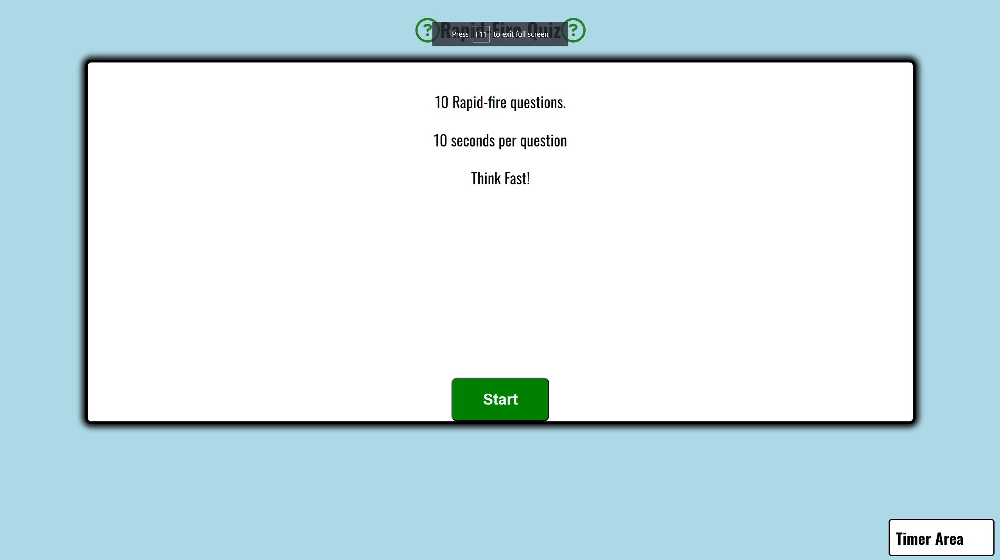
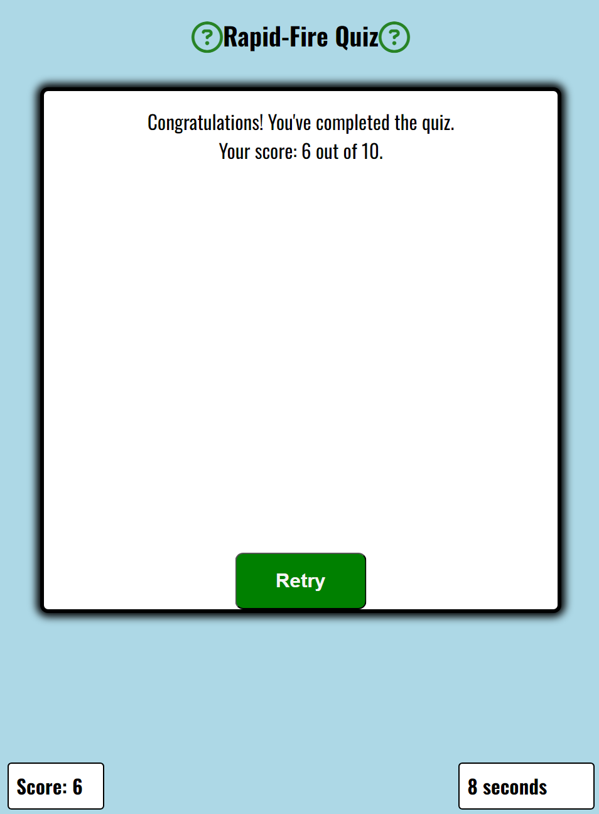
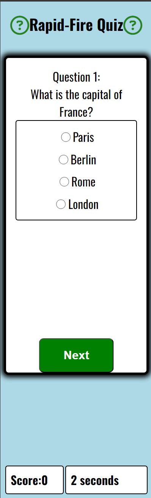
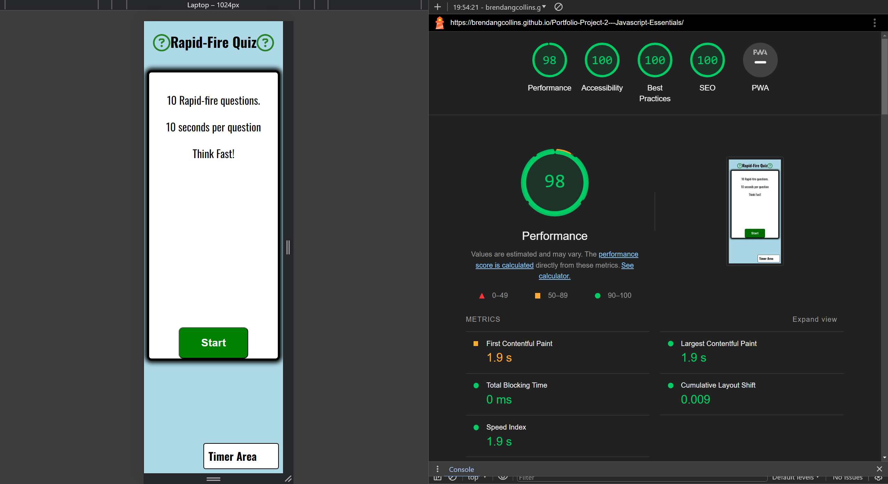
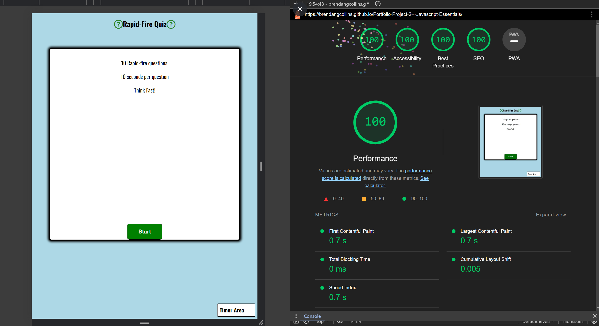

# Rapid-Fire Quiz

A fun, rapid fire quiz to test your general knowledge. Randomly selected questions and a countdown timer to add pressure! It tracks your score out of 10 and lets you know how you did at the end. Quiz can be retried at the end to try and beat your top score. 

How my pages look across desktop, tablet and mobile.

## Features
### Existing Features

- Landing page with Explanation
   - The landing page is simple and intuitive. It provides a quick explanation of how the quiz works and a big start button.
- Question Counter
   - A counter to keep track of what number question you are on   
- Randomly chosen questions each time
   - I have added an array of 20 questions and shuffle the questions so that each time you start the quiz you get different questions given to you. No question will be repeated twice in the quiz.
- Countdown Timer
  - A 10 second countdown timer starts as soon as you click the start button. If it reaches zero you will get 0 points. You will also be shown the correct answer and can review the question before clicking 'next' to continue with the quiz. Radio buttons are disabled if timer reaches zero to prevent a user clicking the correct answer after it has been shown.
  - Timer resets for every question and stops once you finish the last question.
- Score Counter
  - A score counter to track your score out of 10. One point for each correct answer, no point if incorrect or if not answered within the 10 seconds.
- Visual Cues
  - Game area goes green if correct. If incorrect, score area turns red and the correct answer is highlighted for two seconds before moving automatically to the next question.
- Congratulations Message
  - At the end of the quiz a message will appear letting you know how you did in the quiz.
- Restart Feature
- At the end of the quiz you can click the restart button to restart the quiz with score and timer reset. Questions will be shhuffled again.

### Features Left to Implement

- Highscore board where users could input their name and be added to a leaderboard.
- Addittional quiz options to test different areas of knowledge.

## Testing
- All html,css and javascript was passed through w3c validator and [https://jshint.com] .  Results shared below.

- Project was tested with lighthouse to ensure accessibility and performance was to a high quality. I ran a test for mobile pages and another for desktop pages. Results are posted below.

- I have also tested the site by manually clicking through all available links to ensure they are working correctly. I have included the results of this test in a table below.

## Validator Testing
### HTML
- No errors were returned when passing through the official W3C validator
[https://validator.w3.org/nu/?showsource=yes&doc=https%3A%2F%2Fbrendangcollins.github.io%2FPortfolio-Project-2---Javascript-Essentials%2F]

### CSS
- No errors were found when passing through the official (Jigsaw) validator
[https://jigsaw.w3.org/css-validator/validator?uri=https%3A%2F%2Fbrendangcollins.github.io%2FPortfolio-Project-2---Javascript-Essentials%2F&profile=css3svg&usermedium=all&warning=1&vextwarning=&lang=en]

### Javascript
- No errors were found when passing through [https://jshint.com]

### Lighthouse mobile report 

### Lighthouse desktop report 

### Manual Testing

  <table>
    <tr>
            <th>Action</th>
            <th>Expected Behavior</th>
            <th>Pass or Fail</th>
    </tr>
    <tr>
            <td>Click 'Start' button</td>
            <td>Random question appears, timer starts counting down and current score appears</td>
            <td>Pass</td>
    </tr>
    <tr>
            <td>Correct answer is selected but next button is not clicked</td>
            <td>Timer stops until 'next' button is clicked</td>
            <td>Pass</td>
    </tr>
    <tr>
            <td>Click on radio buttons after timer runs out</td>
            <td>Radio buttons should be disabled and I cannot click an answer</td>
            <td>Pass</td>
    </tr> 
    <tr>
            <td>Click 'next' button after selecting correct answer</td>
            <td>'Game area' turns green to confirm correct answer, score is updates to reflect this. Next question loads after two seconds and timer restarts</td>
            <td>Pass</td>
    </tr>
    <tr>
            <td>Incorrect answer is selected but 'next' button is not clicked</td>
            <td>Timer stops until 'next' button is clicked</td>
            <td>Pass</td>
    </tr>
    <tr>
            <td>Click 'next' button after selecting incorrect answer</td>
            <td>'Game area' turns red to confirm incorrect answer, correct answer is higlighted in green. Score does not increase. Next question loads after delay of two seconds and timer restarts</td>
            <td>Pass</td>
    </tr>
    <tr>
            <td>Start quiz and select no answer and let timer count to 0</td>
            <td>'Game area' turns red to confirm incorrect answer, correct answer is higlighted in green. Radio buttons are disabled to prevent clicking an answer.</td>
            <td>Pass</td>
    </tr>
    <tr>
            <td>After letting timer run to 0 and quiz showing the correct answer click on 'next' button</td>
            <td>Quiz resumes on the next question, radio buttons re-enabled and timer restarts</td>
            <td>Pass</td>
    </tr>
    <tr>
            <td>Reach question 10 on the quiz</td>
            <td>'Next' button is hidden and 'Finish' button appears in its place</td>
            <td>Pass</td>
    </tr>
    <tr>
            <td>Click 'Finish' button </td>
            <td>Congratulations message appears showing how you scored in the quiz. Timer stops. 'Finish' button is hidden and replaced with 'retry' button</td>
            <td>Pass</td>
    </tr>
    <tr>
            <td>Click 'Retry' button</td>
            <td>Question counter resets. Timer resets. Score resets. A new random question is generated</td>
            <td>Pass</td>
    </tr>
    <tr>
            <td>Reload page multiple times</td>
            <td>Ensure questions are random</td>
            <td>Pass</td>
    </tr>
    <tr>
            <td>Restart the quiz multiple times</td>
            <td>Ensure questions are random</td>
            <td>Pass</td>
    </tr>    
    <tr>
            <td>Play through the quiz multiple times</td>
            <td>Ensure no repeating question</td>
            <td>Pass</td>
    </tr>          
  </table>

## Unfixed Bugs
- No bugs found at the end of this project.

## Deployment

The site was deployed to GitHub pages. The steps to deploy are as follows:

Go to the Settings tab of your GitHub repo. On the left-hand sidebar, in the Code and automation section, select Pages.

Set sourse to 'Deploy from Branch'.

Select main branch

Make sure your folder is set to / (root)

Click on save

Wait a few minutes for the site to update then go back to the main page by clicking "code" in the top left of the screen.

Click on "Deployments" in the bottom right of the sceen.

The live link can be found here - [https://brendangcollins.github.io/Portfolio-Project-2---Javascript-Essentials/]

## Credits
Lots of questions answered through [https://www.w3schools.com/]
Lots of questions answered through [https://stackoverflow.com/]
Helpful video for javascript [https://www.youtube.com/watch?v=EerdGm-ehJQ]

## Content
The icon in the main page was taken from Font Awesome [https://fontawesome.com/]
Text style was taken from Google Fonts [https://fonts.google.com/]

## Media
- No addittional media was required for this project.